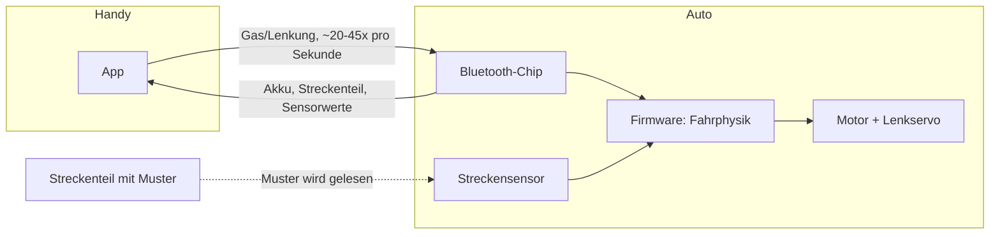

# Wie Carrera Hybrid Autos funktionieren

Dieses Dokument erklärt die Technik hinter den Carrera Hybrid Fahrzeugen. Es geht nicht um eine bestimmte App, sondern um das Fahrzeug und das System dahinter.

## Überblick

Carrera Hybrid ist eine Mischung aus klassischer Carrera-Rennbahn und freiem Ferngesteuert-Fahren. Bei einer klassischen Carrera-Bahn läuft das Auto in einer Rille auf der Schiene. Es kann die Spur nicht verlassen.

Bei Carrera Hybrid ist das anders. Die Fahrzeuge fahren frei, ohne Schiene und ohne Rille. Sie erkennen die Strecke trotzdem, weil die Streckenteile eine Markierung tragen. Ein Sensor im Auto liest diese Markierung. So weiß das Auto, wo es sich befindet und was für ein Streckenteil vor ihm liegt.

Gesteuert wird das Auto über eine Smartphone-App per Bluetooth. Es gibt auch einen optionalen Controller, in den man das Handy einklemmen kann. Der Controller hat richtige Knöpfe statt Touchscreen-Tasten.

## Der Aufbau des Autos

Ein Carrera Hybrid Auto enthält folgende Hauptteile:

- **Motor**: treibt die Hinterräder an.
- **Lenkservo**: dreht die Vorderräder nach links oder rechts.
- **Akku**: ein wiederaufladbarer Akku im Fahrzeug.
- **Bluetooth-Chip**: ein kleiner Funk-Chip, der die Verbindung zum Handy hält. Vermutlich ein Chip aus der Nordic-nRF52-Familie (dazu mehr weiter unten).
- **Sensor**: erkennt die Markierung auf den Streckenteilen. Ob es sich um eine kleine Kamera oder einen einfacheren Infrarot-Sensor handelt, ist nicht sicher bekannt.
- **Lichter**: mindestens Frontscheinwerfer. Ob es ein separates Bremslicht gibt, ist noch nicht bestätigt.

Die eigentliche Fahrphysik, also wie das Auto auf Gas und Lenkung reagiert, wird im Auto selbst berechnet. Die App schickt nur Zielwerte für Gas und Lenkung. Sie berechnet keine Fahrdynamik.

## Die Streckenteile

Jedes Streckenteil (Gerade, Kurve, Start-Ziel-Linie) hat ein eigenes Muster aufgedruckt. Dieses Muster ist für Menschen kaum sichtbar, aber für den Sensor im Auto lesbar.

So kann das Auto erkennen:

- welche Art von Teil gerade unter ihm liegt (Gerade, Rechtskurve, und so weiter)
- ob es sich noch auf der Strecke befindet oder bereits daneben fährt ("Off-Track")

Weil die Teile lose auf dem Boden oder Tisch liegen und keine feste Schiene bilden, kann jede Strecke frei zusammengebaut werden. Das Auto kann die Strecke auch komplett verlassen und irgendwo frei herumfahren.

## Streckenscan

Bevor ein Rennen beginnt, kann die App die Strecke einmal abscannen. Dabei fährt das Auto (gesteuert von der App oder von Hand) einmal die ganze Strecke ab. Jedes Mal, wenn ein neues Streckenteil erkannt wird, meldet das Auto das per Bluetooth an die App.

So entsteht Stück für Stück eine digitale Karte der Strecke. Diese Karte kann die App später nutzen, zum Beispiel für eine Renn-Übersicht oder für computergesteuerte Gegner.

## Die Bluetooth-Verbindung

Handy und Auto sprechen über **Bluetooth Low Energy** (kurz BLE) miteinander. Das ist der stromsparende Bluetooth-Standard, den auch smarte Kopfhörer oder Fitness-Tracker nutzen.

Die Verbindung läuft über einen Kanal, der als **Nordic UART Service** bekannt ist. Das ist eine Art virtuelle serielle Leitung über Bluetooth. Viele kleine Elektronikgeräte nutzen diesen Standardkanal, weil er einfach einzubauen ist.

Wichtig ist: Die App schickt nicht nur einmal ein Kommando, wenn man Gas gibt. Sie schickt stattdessen etwa 20 bis 45 Mal pro Sekunde ein Datenpaket mit dem aktuellen Gas- und Lenkwert. Das Auto erwartet diesen ständigen Strom an Befehlen. Bleibt der Strom aus, geht das Auto vermutlich in einen sicheren Stillstand über.

In die andere Richtung, vom Auto zum Handy, schickt das Auto ebenfalls ständig Statuspakete. Darin stecken unter anderem:

- der Akkustand
- welches Streckenteil gerade erkannt wurde
- ob das Auto von der Strecke abgekommen ist
- Rohdaten von Bewegungssensoren (vermutlich Beschleunigung oder Drehrate)

## Wer steuert die Fahrphysik?

Ein wichtiger Punkt, den man leicht falsch einschätzt: Die App ist kein Physik-Simulator. Sie schickt dem Auto nur, was der Fahrer will (wie viel Gas, welche Lenkrichtung). Das Auto selbst entscheidet, wie es darauf reagiert.

Das erklärt auch, warum der Gaswert kein einfacher "Stopp bis Vollgas"-Wert ist. Er wirkt eher wie ein Wert, der sich weich hoch- und runterregelt, ähnlich wie beim Gasgeben in einem echten Auto. Die Feinarbeit passiert in der Firmware des Autos, nicht in der App.

## Mehrspieler-Rennen

Laut Hersteller können mehrere Spieler gleichzeitig fahren. Jedes Handy verbindet sich dabei über Bluetooth mit seinem eigenen Auto. Für die Renn-Organisation zwischen den Handys, etwa Rundenzeiten oder Startreihenfolge, wird vermutlich zusätzlich WLAN zwischen den Handys genutzt.

Das ergibt zwei getrennte Funkverbindungen:

1. Bluetooth: Handy zu seinem eigenen Auto (Steuerung).
2. WLAN: Handy zu Handy (Rennorganisation).

## Firmware-Updates

Das Auto unterstützt Updates seiner eigenen Software über Bluetooth. Das nennt man "Over-the-Air-Update" oder kurz OTA-Update. Dafür wird ein Standardverfahren von Nordic Semiconductor genutzt, das bei sehr vielen Bluetooth-Geräten zum Einsatz kommt.

Das bedeutet: Der Hersteller kann über die App neue Firmware auf das Auto spielen, zum Beispiel um Fehler zu beheben oder das Fahrverhalten zu verbessern.

## Was noch nicht sicher bekannt ist

Manche Details lassen sich nur aus dem beobachteten Verhalten ableiten, nicht mit letzter Sicherheit belegen. Dazu gehören:

- der genaue Typ des Streckensensors (Kamera oder Infrarot)
- ob es ein eigenes Bremslicht gibt und wie es angesteuert wird
- die genaue Bedeutung aller Bytes im Bluetooth-Protokoll

Diese Lücken ändern nichts am Grundprinzip: Ein Sensor liest die Strecke, ein Funkchip verbindet Auto und Handy, und die eigentliche Fahrphysik läuft im Auto selbst.
