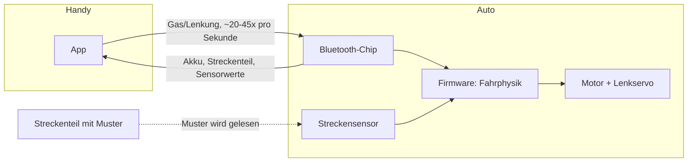

# Wie Carrera Hybrid Autos funktionieren

Dieses Dokument erklärt die Technik hinter den Carrera Hybrid Fahrzeugen. Es geht nicht um eine bestimmte App, sondern um das Fahrzeug und das System dahinter.

## Überblick

Carrera Hybrid ist eine Mischung aus klassischer Carrera-Rennbahn und freiem Ferngesteuert-Fahren. Bei einer klassischen Carrera-Bahn läuft das Auto in einer Rille auf der Schiene. Es kann die Spur nicht verlassen.

Bei Carrera Hybrid ist das anders. Die Fahrzeuge fahren frei, ohne Schiene und ohne Rille. Sie erkennen die Strecke trotzdem, weil die Streckenteile eine Markierung tragen. Ein Sensor im Auto liest diese Markierung. So weiß das Auto, wo es sich befindet und was für ein Streckenteil vor ihm liegt.

Gesteuert wird das Auto über eine Smartphone-App per Bluetooth. Es gibt auch einen optionalen Controller, in den man das Handy einklemmen kann. Der Controller hat richtige Knöpfe statt Touchscreen-Tasten.

## Der Aufbau des Autos

Ein Carrera Hybrid Auto enthält folgende Hauptteile:

- **Motor**: treibt die Hinterräder an.
- **Lenkservo**: dreht die Vorderräder nach links oder rechts.
- **Akku**: ein wiederaufladbarer Akku im Fahrzeug.
- **Bluetooth-Chip**: ein kleiner Funk-Chip, der die Verbindung zum Handy hält. Vermutlich ein Chip aus der Nordic-nRF52-Familie (dazu mehr weiter unten).
- **Sensor**: erkennt die Markierung auf den Streckenteilen. Ob es sich um eine kleine Kamera oder einen einfacheren Infrarot-Sensor handelt, ist nicht sicher bekannt.
- **Lichter**: mindestens Frontscheinwerfer. Ob es ein separates Bremslicht gibt, ist noch nicht bestätigt.

Die eigentliche Fahrphysik, also wie das Auto auf Gas und Lenkung reagiert, wird im Auto selbst berechnet. Die App schickt nur Zielwerte für Gas und Lenkung. Sie berechnet keine Fahrdynamik.

## Die Streckenteile

Jedes Streckenteil (Gerade, Kurve, Start-Ziel-Linie) hat ein eigenes Muster aufgedruckt. Dieses Muster ist für Menschen kaum sichtbar, aber für den Sensor im Auto lesbar.

So kann das Auto erkennen:

- welche Art von Teil gerade unter ihm liegt (Gerade, Rechtskurve, und so weiter)
- ob es sich noch auf der Strecke befindet oder bereits daneben fährt ("Off-Track")

Weil die Teile lose auf dem Boden oder Tisch liegen und keine feste Schiene bilden, kann jede Strecke frei zusammengebaut werden. Das Auto kann die Strecke auch komplett verlassen und irgendwo frei herumfahren.

### Zwei getrennte Codetabellen

Der Sensor arbeitet in zwei Betriebsarten, und **jede hat ihre eigene Codetabelle**. Das ist
der Punkt, an dem die Musterentzifferung monatelang falsch lief: dasselbe gedruckte Blatt hat
0x0a, 0x03 und 0x01 gemeldet, und daraus wurde geschlossen, der Unterschied liege im Druck —
Maßstab, Strichbreite, Schwärze, Papier. Er lag am Modus.

| Bahn-Modus (Byte 14, Bit 5) | Ausdruck-Modus (Byte 14, Bit 7) |
|---|---|
| `0x02` Gerade | `0x01` Start/Ziel |
| `0x03` Linkskurve | |
| `0x04` Rechtskurve | |
| `0x05` / `0x06` Haarnadel | |
| `0x0a` Start/Ziel | |
| `0x00` abseits der Bahn | |

Die beiden Bits schließen sich aus. Wer Codes vergleicht, muss also den Modus mitnennen —
`0x01` heißt auf Papier Start/Ziel, und auf der Schiene ist `0x0a` dasselbe.

Offen ist damit nur noch, welche Balkenfolgen `0x02` (Gerade) und `0x04` (Rechtskurve)
tragen. Die Folge für `0x01` liegt vektorgenau vor, weil sie aus der Original-Druckvorlage
stammt (siehe unten).

### Wieviel Anlauf der Leser braucht — gemessen

Drei Messungen am gedruckten Start/Ziel-Blatt, alle am Auto gemacht:

1. **Die drei führenden dünnen Striche lassen sich abschneiden**, das Blatt wird weiter
   gelesen. Der Vorlauf ist damit **kein Nutzdatum**, sondern die Strecke, auf der sich der
   Leser auf die Modulbreite einstellt — und dafür genügt weniger als das Original bietet.
2. **Eines der beiden wiederholten Muster genügt.** Zusammen mit Punkt 1 ist die kleinste
   tragende Nutzlast ein einzelnes Wort ohne Vorlauf, etwa **54 mm** in Fahrtrichtung statt
   der 75,5 mm der Vorlage.
3. **Nach einem Erkennen bleibt der Leser etwa eine Sekunde stumm.** Bei 4 km/h
   Maßstabstempo sind das 1,1 m Fahrweg, also gut zweieinhalb Kachellängen. Ein Muster öfter
   als etwa jeden Meter zu wiederholen bringt deshalb nichts — und dieselbe Sperre ist der
   Grund, warum die Boxengassen-Erkennung per Doppel-Ausdruck einen Mindestabstand von einer
   Sekunde zwischen den beiden Kontakten fordert (`PIT_DOUBLE_MIN_MS`). Der Wert war
   ursprünglich geschätzt; er ist damit bestätigt.

Damit sind die fünf Vorlauf- und acht Probeblätter aus dem Repo verschwunden: das Experiment,
für das sie gebaut wurden, ist gelaufen. `tools/make_patterns.py` erzeugt sie in einem Aufruf
wieder, falls doch noch eine Probe gebraucht wird.

### Warum die Schienenmuster (noch) nicht entziffert sind

Am 31.08. wurden fünf Infrarot-Aufnahmen echter Streckenteile ausgemessen — Start/Ziel,
Gerade und Rechtskurve, aus einem Video. Der Versuch ist **gescheitert**, und zwar messbar:

| Prüfmaß | erwartet | gemessen |
|---|---|---|
| Restabstand des Fluchtpunkt-Fits der Balkenlinien | wenige px | **237 bis 579 px** |
| Verhältnis dicker zu dünner Balken | 1,83 | **1,09 bis 1,68** |

Der erste Wert sagt, dass die Balkenlinien sich nicht in *einem* Punkt treffen — sie sind
also nicht das Bild parallel liegender Weltlinien, und ohne diese Annahme lässt sich das Bild
nicht entzerren. Der zweite sagt, dass die beiden Breitenklassen im Rauschen verschwimmen:
JPEG-Kompression auf 20-Pixel-Merkmale, Weitwinkelverzerrung, ein Lichtfleck in der Bildmitte
und eine Hand im Bild.

Drei Verfahren wurden probiert und alle drei berichtet, weil das Scheitern jeweils eine
andere Ursache hat:

1. **Waagerechte Abtastlinie** — falsch, weil ein um θ gekippter Balken um 1/cos θ zu breit
   erscheint. Die Balken fächern von stark gekippt bis senkrecht, und daraus kamen
   Breitenverhältnisse bis 1:100. Das war Perspektive, nicht Information.
2. **Dicke senkrecht zum Balken**, über eine Hauptachsenzerlegung je zusammenhängendem
   Gebiet — richtig gemessen, aber die Ordnung stimmt nicht: eine globale Fahrtrichtung
   projiziert Balken aus verschiedenen Radien auf dieselbe Achse, und daraus wurden negative
   Lücken.
3. **Kleine Felder mit lokal gemessenem Winkel** — sauber, aber je Feld nur 6 bis 9 Balken.
   Aus so wenigen lässt sich keine Zweiklassen-Trennung belegen, und ein Median-Schnitt
   erzwingt eine Trennung auch dort, wo alle Balken gleich breit sind.

**Was die Bilder trotzdem belegen**, und beides geht in die Druckvorlagen ein:

- Die Balken bedecken die **ganze** Kachel, 40 und mehr je sichtbarem Abschnitt. Das Wort
  wiederholt sich also fortlaufend, damit das Auto es liest, wo immer es auffährt.
- In Kurven laufen die Balken **radial**. Sie treffen sich im Kurvenmittelpunkt, nicht in
  einem perspektivischen Fluchtpunkt — genau deshalb schlug der Fluchtpunkt-Fit dort fehl.

**Was es bräuchte:** einen **Flachbett-Scan** eines echten Streckenteils, 300 dpi, flach
aufgelegt. Dort gibt es keine Perspektive, keinen Lichtfleck und keine Videokompression, und
die Balkenbreiten sind direkt in Millimetern messbar. Ein einziger Scan einer Geraden und
einer Kurve würde beide Wörter liefern.

### Die Maße des Start/Ziel-Musters

Aus `target_finish.pdf` ausgelesen, nicht nachgemessen (`tools/make_pattern.py`):

```
dünner Balken   3,598 mm      dicker Balken   6,604 mm
dünne Lücke     3,514 mm      dicke Lücke     6,530 mm
Balkenbreite quer 275,9 mm    Musterlänge in Fahrtrichtung 75,5 mm
9 Balken, 8 Lücken:  Balken 000010010   Lücken 00010110   (1 = dick, in Leserichtung)
```

Balken **und** Lücken tragen Information, das Verhältnis dick/dünn ist 1,83 — die Bauform
eines Strichcodes mit schmalen und breiten Elementen, 17 Elemente je Wort. Die Balkenbreite
von 275,9 mm ist volle A4-Querbreite, bei 250 mm Bahnbreite.

## Streckenscan

Bevor ein Rennen beginnt, kann die App die Strecke einmal abscannen. Dabei fährt das Auto (gesteuert von der App oder von Hand) einmal die ganze Strecke ab. Jedes Mal, wenn ein neues Streckenteil erkannt wird, meldet das Auto das per Bluetooth an die App.

So entsteht Stück für Stück eine digitale Karte der Strecke. Diese Karte kann die App später nutzen, zum Beispiel für eine Renn-Übersicht oder für computergesteuerte Gegner.

## Die Bluetooth-Verbindung

Handy und Auto sprechen über **Bluetooth Low Energy** (kurz BLE) miteinander. Das ist der stromsparende Bluetooth-Standard, den auch smarte Kopfhörer oder Fitness-Tracker nutzen.

Die Verbindung läuft über einen Kanal, der als **Nordic UART Service** bekannt ist. Das ist eine Art virtuelle serielle Leitung über Bluetooth. Viele kleine Elektronikgeräte nutzen diesen Standardkanal, weil er einfach einzubauen ist.

Wichtig ist: Die App schickt nicht nur einmal ein Kommando, wenn man Gas gibt. Sie schickt stattdessen etwa 20 bis 45 Mal pro Sekunde ein Datenpaket mit dem aktuellen Gas- und Lenkwert. Das Auto erwartet diesen ständigen Strom an Befehlen. Bleibt der Strom aus, geht das Auto vermutlich in einen sicheren Stillstand über.

In die andere Richtung, vom Auto zum Handy, schickt das Auto ebenfalls ständig Statuspakete. Darin stecken unter anderem:

- der Akkustand
- welches Streckenteil gerade erkannt wurde
- ob das Auto von der Strecke abgekommen ist
- Rohdaten von Bewegungssensoren (vermutlich Beschleunigung oder Drehrate)



## Wer steuert die Fahrphysik?

Ein wichtiger Punkt, den man leicht falsch einschätzt: Die App ist kein Physik-Simulator. Sie schickt dem Auto nur, was der Fahrer will (wie viel Gas, welche Lenkrichtung). Das Auto selbst entscheidet, wie es darauf reagiert.

Das erklärt auch, warum der Gaswert kein einfacher "Stopp bis Vollgas"-Wert ist. Er wirkt eher wie ein Wert, der sich weich hoch- und runterregelt, ähnlich wie beim Gasgeben in einem echten Auto. Die Feinarbeit passiert in der Firmware des Autos, nicht in der App.

### Was OmegaSim daneben rechnet

Die Aussage oben gilt fuer das Auto: die Fahrdynamik entsteht in seiner Firmware. OmegaSim
rechnet daneben ein eigenes Modell, und zwar nicht als Ersatz, sondern um die **zwei Bytes zu
formen**, die ohnehin gesendet werden. Der Unterschied ist wichtig: alles, was das Modell tut,
muss am Ende ein Gaswert und ein Lenkwert sein, sonst kommt es am Auto nicht an.

**Gewichtsverlagerung, vier Raeder.** Aus Gas, Bremse und Lenkung folgt eine Lastverteilung
auf vier Raeder:

- **Bremsen verlagert nach vorn**, Gas nach hinten. Der Achsanteil laeuft von 0,2 bei Vollgas
  ueber 0,5 im Rollen bis 0,8 unter Vollbremsung.
- **Lenken verlagert nach aussen.** Eine Rechtskurve belastet die linken Raeder.
- Beides multipliziert ergibt die Radlast, **im Mittel immer genau 1,0**. Gemessen fuer eine
  Rechtskurve unter Vollbremsung: vorne links 2,72, vorne rechts 0,48, hinten links 0,68,
  hinten rechts 0,12. Die Linkskurve ist die exakte Spiegelung.

Die Verlagerung **verschiebt** Last, sie erfindet keine: der Verschleissmittelwert ist mit und
ohne Asymmetrie exakt gleich. Aus den vier Radlasten folgen vier Reifentemperaturen, vier
Verschleisswerte und vier Bremsscheibentemperaturen, und die stehen so im Cockpit.

**Was davon wirkt und was nur anzeigt.** Das Auto rutscht in echt nicht, also kann das Modell
nur ueber die zwei Bytes wirken:

| Groesse | Art | Wirkung |
|---|---|---|
| Reibkreis (Bremsen nimmt Lenkung) | Aktor | schneidet den Lenkwert |
| Bremsfading | Aktor | verlaengert den Bremsweg ueber das Bremsbyte |
| Reifengriff kalt/heiss/abgefahren | Aktor | senkt Lenk- und Bremswert |
| Reifenzug bei ungleichem Verschleiss | Aktor | kleiner Lenk-Offset |
| Radlasten, Temperaturen, Scheiben | Instrument | Anzeige im Cockpit |

**Der Reibkreis** ist der Teil, den man am deutlichsten spuert: was die Bremse an der
Vorderachse verbraucht, fehlt der Lenkung. Er hat einen Boden von 0,12, damit das Auto nie
voellig hilflos ist - im Regen wird dieser Boden weggeskaliert, weil dort wirklich nichts mehr
uebrig ist.

### Die Lenkgrenze: 45 Grad, und kein Regler kommt darueber

Byte 7 traegt den Lenkwert als `round(winkel * 127)` in einem **vorzeichenbehafteten** Byte.
127 ist das Maximum dieses Bereichs, und die App sendet es bei Vollanforderung. Daraus folgt:

- Kein Reglerwert kann das Auto weiter einschlagen lassen als seine Mechanik. Die 45 Grad sind
  eine Grenze des Fahrzeugs, nicht der Software.
- Ein Wert **ueber** 1,0 waere schaedlich und nicht nur wirkungslos: beim Umbruch des
  vorzeichenbehafteten Bytes kaeme er als Einschlag in die ANDERE Richtung an. Der Deckel bei
  1,0 ist deshalb keine Vorsicht, sondern notwendig.

Was eine Kalibrierung dennoch bringt: der uebertragene Winkel wird **vor** dem Senden mit dem
Reibkreis multipliziert. Beim Anbremsen einer engen Kurve - dem Moment mit dem groessten
Einschlagbedarf - bleiben davon etwa 60 bis 77 Prozent. Eine Kalibrierung hinter dieser
Multiplikation holt das zurueck. Gemessen bei 60 km/h unter Vollbremsung:

| Kalibrierung | 100 % | 150 % | 200 % | 250 % | 300 % |
|---|---|---|---|---|---|
| erreichter Winkel | 35 Grad | 45 Grad | 45 Grad | 45 Grad | 45 Grad |
| Anschlag ab Stickanteil | nie | 40 % | 30 % | 25 % | 20 % |

Bei 100 Prozent werden die 45 Grad also **nie** erreicht. Oberhalb von 150 Prozent ist bei
vollem Ausschlag nichts mehr zu holen; der Unterschied liegt nur darin, wo im Stickweg der
Anschlag anliegt - und der Preis ist Feingefuehl, weil der letzte Teil des Sticks dann nichts
mehr sagt.

**Die zwei Regler arbeiten gegeneinander**, und das ist keine Nachlaessigkeit, sondern folgt
aus der Rechnung: eine Kalibrierung von 200 Prozent macht jede Beschneidung oberhalb von 0,5
unsichtbar. Wer den Reibkreis spueren will, muss die Kalibrierung senken oder den Reibkreis so
weit aufdrehen, dass die Kalibrierung ihn nicht mehr ausgleichen kann.

### Controller: eine Taste, eine Bedeutung

Die Belegung steht zuweisbar in den Optionen unter Controller. Ab Werk, mit
PlayStation-Namen zuerst:

| Taste | Aktion |
|---|---|
| R2 / RT | Gas |
| L2 / LT | Bremse |
| Linker Stick, X-Achse | Lenkung |
| Quadrat / X | Runterschalten |
| Kreis / B | Hochschalten |
| Dreieck / Y | Licht an/aus |
| R3 (rechten Stick druecken) | Lichthupe |
| L1 / LB | Leseart: Bahn oder Ausdruck |
| R1 / RB | Getriebe: Automatik oder von Hand |
| Kreuz / A, 1 s halten | Gelbe Flagge |
| Options / Start | Boxenstopp |
| Select / Share | Rennen starten oder abbrechen |
| L3 (linken Stick druecken) | nichts |

Zwei Punkte dazu, beide aus Fehlern gelernt:

- **Die Beschriftungen nennen den PlayStation-Namen zuerst.** "X / Quadrat" war mehrdeutig:
  auf einer Xbox ist Knopf 2 das X, auf einer PlayStation das Quadrat - und "X" bedeutet auf
  einer PlayStation den Knopf 0. Eine Beschriftung, die zwei Tasten bedeuten kann, ist der
  Fehler und nicht der Leser.
- **Jede Taste traegt genau eine Bedeutung.** Der linke Stick loest ausdruecklich nichts aus,
  weil man ihn beim Lenken drueckt. Beim Laden wird auf Kollisionen geprueft: liegen zwei
  Aktionen auf demselben Eingang, geht die zweite auf ihre Vorgabe zurueck, und es wird
  gemeldet statt still behoben.

## Mehrspieler-Rennen

Laut Hersteller können mehrere Spieler gleichzeitig fahren. Jedes Handy verbindet sich dabei über Bluetooth mit seinem eigenen Auto. Für die Renn-Organisation zwischen den Handys, etwa Rundenzeiten oder Startreihenfolge, wird vermutlich zusätzlich WLAN zwischen den Handys genutzt.

Das ergibt zwei getrennte Funkverbindungen:

1. Bluetooth: Handy zu seinem eigenen Auto (Steuerung).
2. WLAN: Handy zu Handy (Rennorganisation).

## Firmware-Updates

Das Auto unterstützt Updates seiner eigenen Software über Bluetooth. Das nennt man "Over-the-Air-Update" oder kurz OTA-Update. Dafür wird ein Standardverfahren von Nordic Semiconductor genutzt, das bei sehr vielen Bluetooth-Geräten zum Einsatz kommt.

Das bedeutet: Der Hersteller kann über die App neue Firmware auf das Auto spielen, zum Beispiel um Fehler zu beheben oder das Fahrverhalten zu verbessern.

## Was noch nicht sicher bekannt ist

Manche Details lassen sich nur aus dem beobachteten Verhalten ableiten, nicht mit letzter Sicherheit belegen. Dazu gehören:

- der genaue Typ des Streckensensors (Kamera oder Infrarot)
- ob es ein eigenes Bremslicht gibt und wie es angesteuert wird
- die genaue Bedeutung aller Bytes im Bluetooth-Protokoll

Diese Lücken ändern nichts am Grundprinzip: Ein Sensor liest die Strecke, ein Funkchip verbindet Auto und Handy, und die eigentliche Fahrphysik läuft im Auto selbst.
